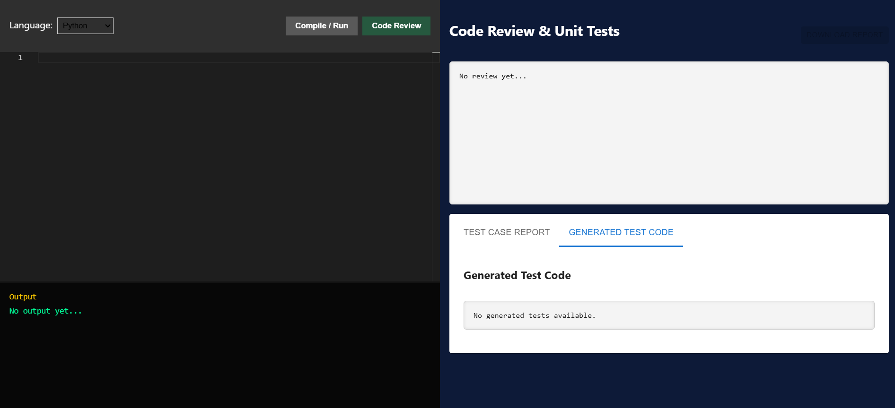
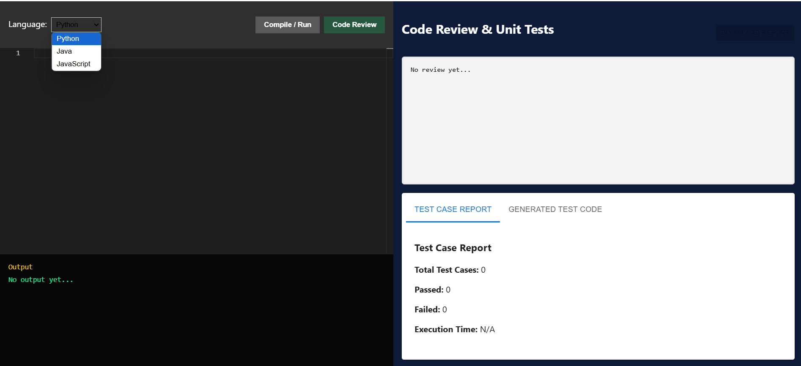
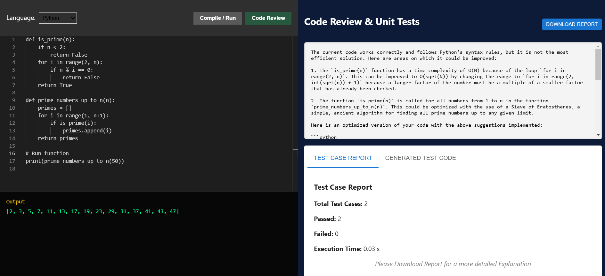
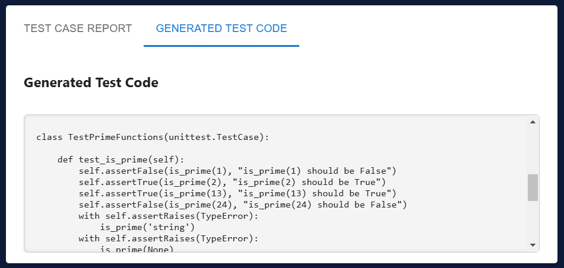
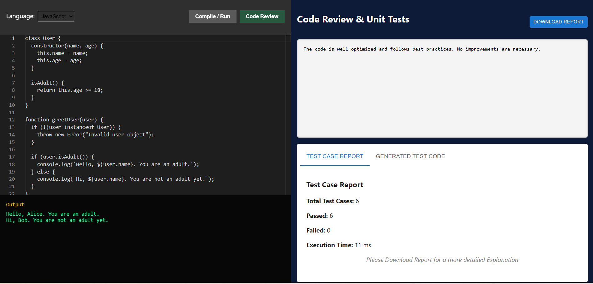
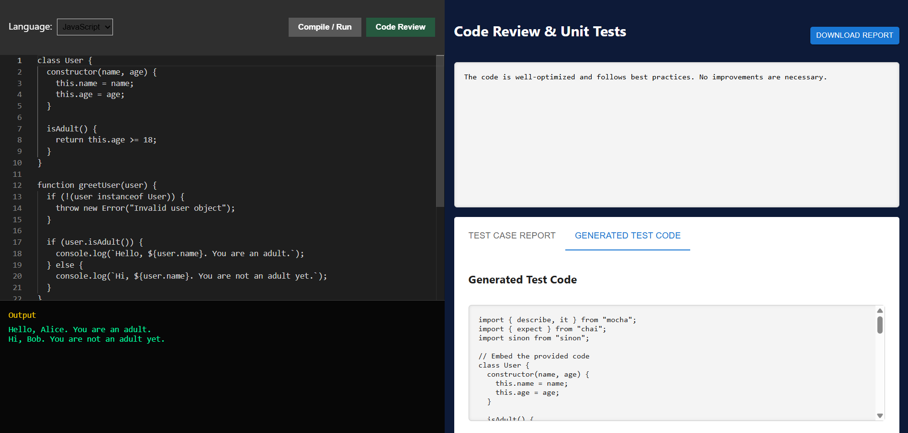
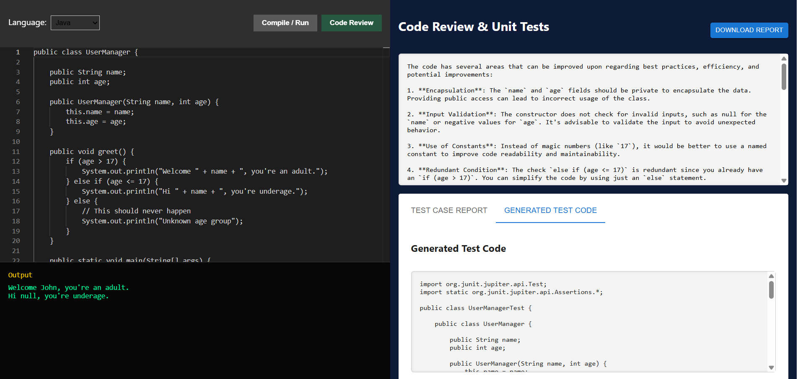

# 🚀 AI-Powered Code Review & Unit Testing Tool

## 📝 Overview
This project is an **AI-powered code review and unit testing tool** that allows users to write, execute, and review code in multiple programming languages (**Python, Java, and JavaScript**). It provides **real-time AI-generated code reviews and unit tests**, offering feedback and improvements based on best practices.

## ✨ Features
- ✅ **Multi-language Support**: Python, Java, JavaScript
- ⚡ **Code Execution**: Runs user-provided code in a secure sandbox environment
- 🤖 **AI-Powered Code Review**: Analyzes code for best practices, efficiency, and potential improvements
- 🧪 **Automated Unit Test Generation**: Generates unit tests using AI and executes them
- 📄 **Downloadable Reports**: Provides detailed reports in PDF format

## 🛠️ Tech Stack
### 🎨 Frontend
- ⚛️ **React.js**
- 📝 **Monaco Editor** (for code editing)
- 🔗 **Axios** (for API communication)
- 🎭 **Material UI** (for UI components)
- 📜 **jsPDF** (for generating downloadable reports)

### 🔧 Backend
- 🐍 **Flask** (Python-based web framework)
- 🤖 **OpenAI API** (for AI-powered review & test generation)
- 🧪 **Pytest / JUnit / Mocha-Chai** (for test execution)
- ☕ **Maven** (for Java test execution)
- 🔄 **Flask-CORS** (for enabling cross-origin requests)

---
## 🚀 Installation & Setup

### 🔗 Prerequisites
- 🟢 **Node.js** (for frontend)
- 🐍 **Python 3** (for backend)
- 📦 **Flask & Dependencies**
- ☕ **Java (JDK)** (for Java execution & testing)
- 🏗️ **Virtual Environment (venv) for Python**

### 📂 Clone the Repository
```sh
$ git clone https://github.com/kamalsrivastava/code_reviewer.git
$ cd code_reviewer
```

### 🔥 Backend Setup
#### 1️⃣ Create and activate virtual environment
```sh
$ cd backend
$ python -m venv venv
$ source venv/bin/activate   # On macOS/Linux
$ venv\Scripts\activate     # On Windows
```

#### 2️⃣ Install dependencies
```sh
$ pip install -r requirements.txt
```

#### 3️⃣ Run Flask Server
```sh
$ python app.py
```

### 🎨 Frontend Setup
#### 1️⃣ Install dependencies
```sh
$ cd frontend
$ npm install
```

#### 2️⃣ Run React App
```sh
$ npm start
```

🚀 The application should now be running at `http://localhost:3000` with the backend at `http://127.0.0.1:5000`.

---
## 🌍 API Endpoints

### 1️⃣ **Execute Code**
🔹 **POST** `/execute`
- 📥 **Request Keys:**
  - `code` (string) - The code to be executed
  - `language` (string) - The programming language
- 📤 **Response Keys:**
  - `output` (string) - The output or error message from execution

### 2️⃣ **AI-Powered Code Review**
🔹 **POST** `/review`
- 📥 **Request Keys:**
  - `code` (string) - The code to be reviewed
  - `language` (string) - The programming language
- 📤 **Response Keys:**
  - `lint_results` (string) - Static analysis results
  - `ai_suggestions` (string) - AI-generated suggestions

### 3️⃣ **Generate & Run Tests**
🔹 **POST** `/test`
- 📥 **Request Keys:**
  - `code` (string) - The code to be tested
  - `language` (string) - The programming language
- 📤 **Response Keys:**
  - `test_cases` (string) - The generated unit tests
  - `test_results` (string) - Summary of test execution
  - `coverage_report` (string) - Code coverage information

---
## 🎯 Usage Guide

1️⃣ **Write Code**: Use the Monaco Editor on the left panel to enter code.

2️⃣ **Select Language**: Choose **Python, Java, or JavaScript** from the dropdown.

3️⃣ **Run Code**: Click **Compile/Run** to execute the code and view output.

4️⃣ **Review Code**: Click **Code Review** to receive AI-generated feedback.

5️⃣ **Generate Tests**: The system will generate and execute tests automatically.

6️⃣ **Download Report**: A detailed test report can be downloaded as a **PDF**.

---
## 📂 File Structure
### 🎨 Frontend
```sh
frontend/
├── node_modules/
├── public/
├── src/
│   ├── components/
│   │   ├── LeftSide.js
│   │   ├── RightSide.js
│   ├── App.js
│   ├── index.js
│   ├── App.css
│   ├── index.css
│   ├── logo.svg
│   ├── reportWebVitals.js
├── package.json
├── package-lock.json
├── .gitignore
```

### 🔥 Backend
```sh
backend/
├── venv/
├── .pytest_cache/
├── __pycache__/
├── app.py
├── checkstyle.jar
├── code_reviewer.py
├── config.py
├── function_extractor.py
├── requirements.txt
├── test_generator.py
├── test_runner.py
├── .gitignore
```

---
## 🚀 Future Enhancements
- 🔹 Add support for more languages (C++, C#)
- 🔹 Enhance AI feedback with deeper static analysis
- 🔹 Improve UI with syntax highlighting improvements
- 🔹 Add integration with GitHub Actions for automated reviews

🎉 **Happy Coding!** 🎉

---

🏠 Home Screen Views


---

---


📊 Sample Output Views


---

---

---

---

---



📄 Sample Reports

📥 
📥 .pdf)
📥 
📥 
